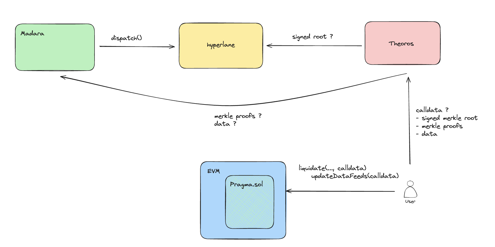

# Theoros

API used to pull data to any Pragma supported chain.

1. Pragma chain emits a `Dispatch` event.
2. Hyperlane validators create a signed checkpoint from this event.
3. On-demand, Theoros API will return the correctly formatted calldata based on
the actual data that was emitted aswell as the signed checkpoint stored by
hyperlane validators.
4. The DApp uses this calldata to update on-demand the data feed on the
destination chain of their choice where Pragma
core contract is deployed.

Theoros is responsible for the correct calldata formatting, you can find the complete
spec in our documentation [here](https://docs.pragma.build).
